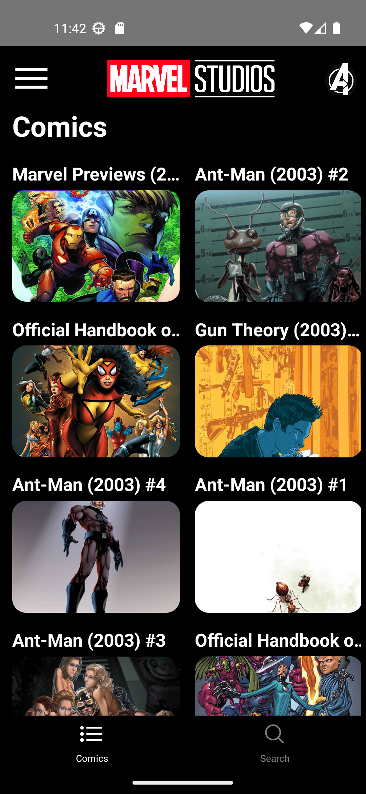
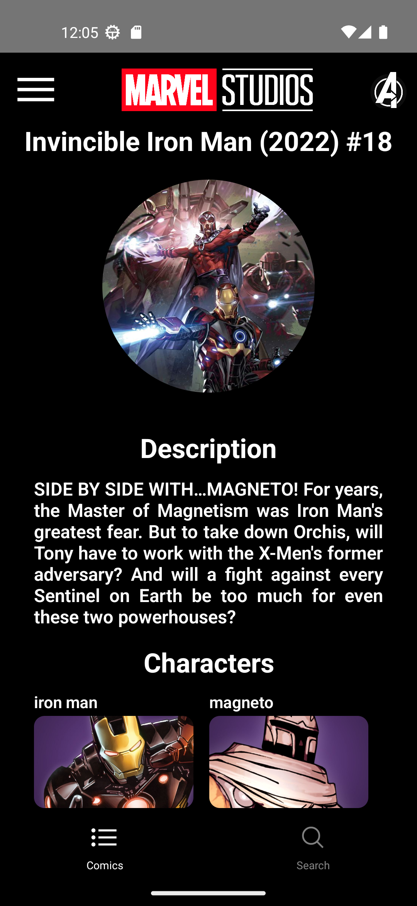

# Marvel app
Marvel comics and characters information app built with React Native.

## Features
 * Infinite character scroll
 * Infinite comic scroll
 * Show an image and information for each character, such as:
    - Description.
    - Comics in which the character appears.
 * Show an image and information for each comic, such as:
    - Description.
    - Characters.
 
## Installation
1. Clone the repository
```bash
git clone https://github.com/Fernando-LRz/marvel-app.git
``` 
2. Go inside the project folder
```bash
cd marvel-app
```
3. Install dependencies
```bash
npm install
```

## Configuration
 * A public and a private Marvel API key are required, both must be added to an .env file. There is a sample .env file in the project.


## Run the app
```bash
npx react-native run-android
```

## App images
| Character home screen                                       | Character search screen                                            | Character info screen                                       | 
| ----------------------------------------------------------- | ------------------------------------------------------------------ | ----------------------------------------------------------- | 
|  |  |   | 

| Comic home screen                                           | Comic search screen                                                | Comic info screen                                           |
| ----------------------------------------------------------- | ------------------------------------------------------------------ | ----------------------------------------------------------- |
|      |      |       |
