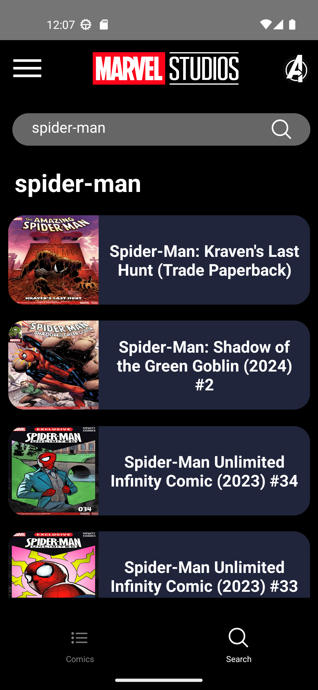

# Marvel app
Marvel comics and characters information app built with React Native.

## Features
 * Infinite character scroll
 * Infinite comic scroll
 * Show an image and information for each character, such as:
    - Description.
    - Comics in which the character appears.
 * Show an image and information for each comic, such as:
    - Description.
    - Characters.
      
## Installation
1. Clone the repository
```bash
git clone https://github.com/Fernando-LRz/marvel-app.git
``` 
2. Navigate to the project directory
```bash
cd marvel-app
```
3. Install dependencies
```bash
npm install
```

## Configuration
 * A public and a private Marvel API key are required, both must be added to a .env file. There is a sample .env file in the project.

## Run the app
```bash
npx react-native run-android
```

## App images
| Characters                                                  | Character                                                  | Character search                                                   | 
| ----------------------------------------------------------- | ---------------------------------------------------------- | ------------------------------------------------------------------ | 
|  |  |  | 

| Comics                                                      | Comic                                                      | Comic search                                                       |
| ----------------------------------------------------------- | ---------------------------------------------------------- | ------------------------------------------------------------------ |
|      |      |      |
